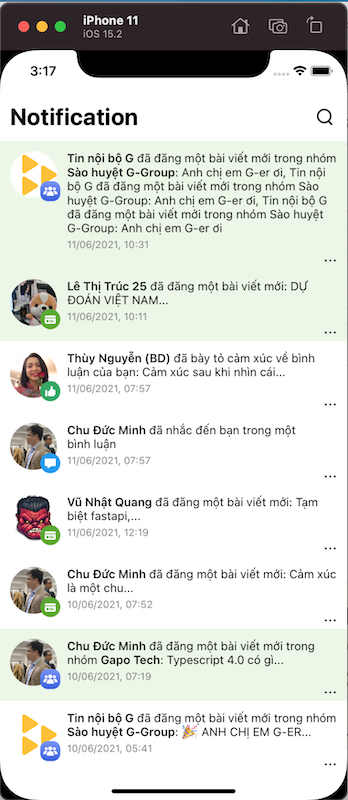

# Gapo Challenge
- Implement Notification List screen
## Demo on simulator
 
## Development
- Language: - Language:  
- IDE: Xcode (version 13.2.1)

## Architecture
- MVVM + Reactive programing

## Design pattern
- Factory
- Dependency Injection

## Environment/Schemes
- [x] debug
- [x] staging
- [x] production

## Dependency package manager
* [Swift package manager](https://developer.apple.com/documentation/swift_packages/adding_package_dependencies_to_your_app)

## Technologies
* [Alamofire](https://github.com/Alamofire/Alamofire), [Kingfisher](https://github.com/onevcat/Kingfisher), [RxSwift](https://github.com/ReactiveX/RxSwift), [XCGLogger](https://github.com/DaveWoodCom/XCGLogger)

## Run app
- Open the MainApp.xcodeproj

### Contact me
- [x] Name: Vo Thuan Quoc Huy
- [x] Email: vothuanquochuy258@gmail.com
- [x] Phone: 0937400387
- [x] Linkedin: [Huy Quoc] (https://www.linkedin.com/in/huy-quoc-954a7a1b1/)

## Liscense
Copyright @HuyVo
